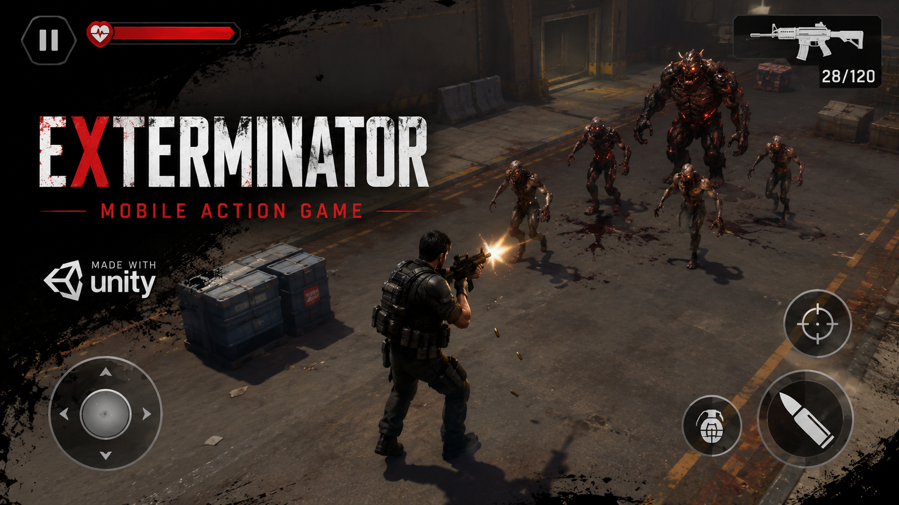
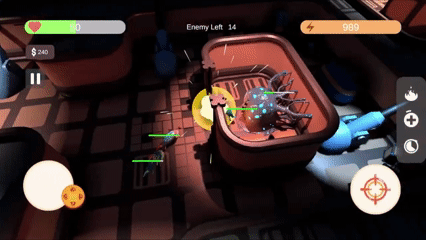

# Exterminator

  

A mobile action game developed in Unity as part of my game development learning journey.

## Gameplay

  

Full Gameplay Video:

https://www.youtube.com/watch?v=qJk6Zg8m2T0

## Overview

Exterminator is a mobile action game focused on combat, enemy encounters, and player progression.

The project was developed to strengthen my understanding of gameplay programming, player control systems, enemy interactions, and mobile game development workflows using Unity.

## Technical Details

| Category | Details        |
| -------- | -------------- |
| Engine   | Unity          |
| Platform | Android / iOS  |
| Genre    | Action         |
| Role     | Solo Developer |

## Responsibilities

- Gameplay Programming
- Player Controller
- Combat Mechanics
- Enemy Behavior
- UI Implementation
- Mobile Development

## Key Learnings

- Unity Development Workflow
- Gameplay System Design
- Mobile Optimization
- Debugging & Testing
- Iterative Development

## Developer

Abdulmajeed Alshammari
Gameplay Programmer
